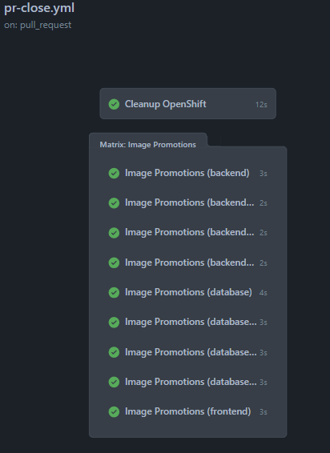
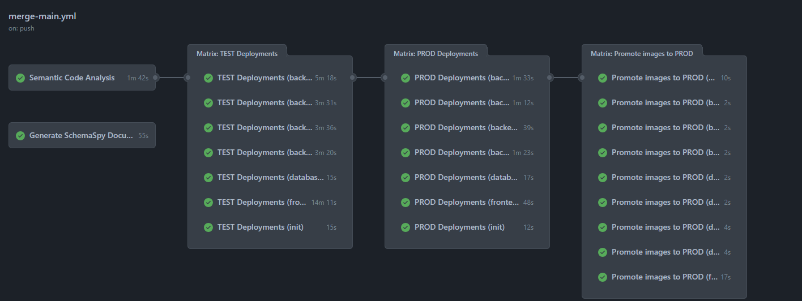
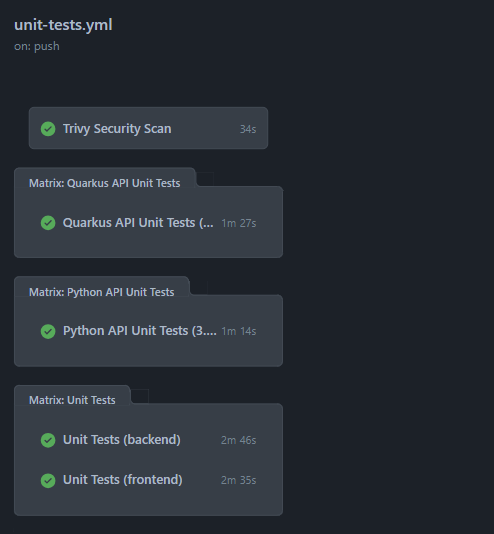
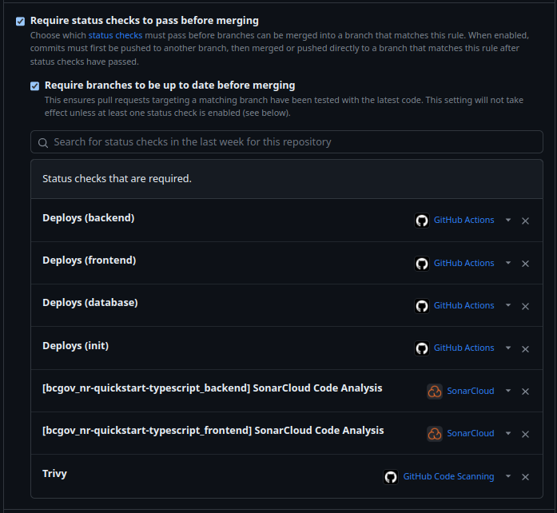
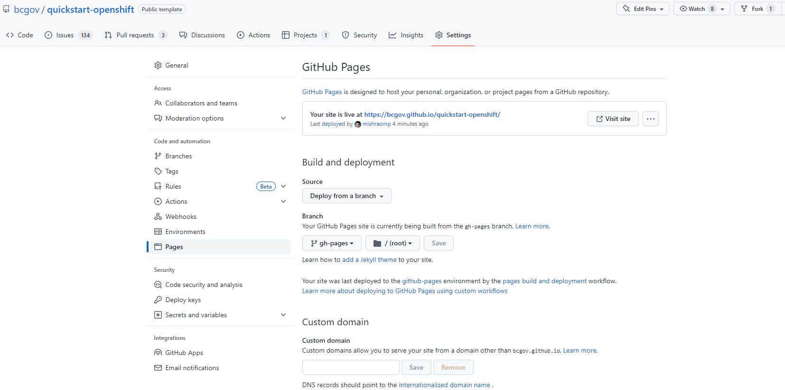

<!-- Project Shields -->

[](https://sonarcloud.io/summary/new_code?id=bcgov_nr-fop)
[](https://github.com/bcgov/nr-fop/actions/workflows/merge-main.yml)
[](https://github.com/bcgov/nr-fop/actions/workflows/unit-tests.yml)

[](/../../issues)
[](/../../pulls)
[](/LICENSE.md)
[](https://github.com/bcgov/repomountie/blob/master/doc/lifecycle-badges.md)

# QuickStart: OpenShift, TypeScript Frontend (React with Caddy WebServer), Pluggable Backend (Nest.js with Node Runtime, FastAPI with Python, Quarkus with Java On Native, Fiber with Golang), and Postgres/PostGIS

The DevOps Quickstart is a fully functional set of pipeline workflows and a starter application stack intended to help Agile DevOps teams hit the ground running.  Currently OpenShift is supported with plans for AWS (Amazon Web Services).  Pipelines are run using [GitHub Actions](https://github.com/bcgov/nr-fop/actions).

Features:
* Pull Request-based pipeline
* Sandboxed development deployments
* Gated production deployments
* Container publishing (ghcr.io) and importing (OpenShift)
* Security, vulnerability, infrastructure and container scan tools
* Automatic Dependabot dependency patching with Pull Requests
* Enforced code reviews and pipeline checks
* Templates and setup documentation
* Starter TypeScript application stack

# Workflows

## Pull Request Opened

Runs on pull request submission.

- Provides safe, sandboxed deployment environments
- Build action pushes to GitHub Container Registry (ghcr.io)
- Build triggers select new builds vs reusing builds
- Deployment includes curl checks and optional penetration tests
- Other checks and updates as required


## Pull Request Closed

Runs on pull request close or merge.

- Cleans up OpenShift objects/artifacts
- Merge promotes successful build images to TEST



## Merge to Main

Runs on merge to main branch.

- Code scanning and reporting to GitHub Security overview
- Zero-downtime* TEST deployment
- Penetration tests on TEST deployment
- Zero-downtime* PROD deployment
- Labels successful deployment images as PROD

\* excludes database changes



## Unit Tests

Runs on pull request submission or merge to main.

- Unit tests (should include coverage)
- Optionally, report results to Sonarcloud



# Starter Application

The starter stack includes a (React, MUI, Vite, Caddy) frontend, Pluggable backend(Nest/Node, Quarkus/Java On Native, FastAPI/Python, Fiber/Golang) and postgres database.  See subfolder for source, including Dockerfiles and OpenShift templates.

Features:
* [TypeScript](https://www.typescriptlang.org/) strong-typing for JavaScript
* [NestJS](https://docs.nestjs.com) Nest/Node backend
* [Quarkus](https://quarkus.io/) Quarkus/Java On Native backend
* [FastAPI](https://fastapi.tiangolo.com/) FastAPI/Python backend
* [Fiber](https://gofiber.io/) Fiber/Golang backend
* [Postgres](https://www.postgresql.org/) or [PostGIS](https://postgis.net/) database
* [backup-container](https://github.com/BCDevOps/backup-container) provided by BCDevOps

Postgres is default.  Switch to PostGIS by copying the appropriate Dockerfile to `./database`:

> cp ./database/postgis/Dockerfile ./database


# Getting Started

Initial setup is intended to take four hours or less.  This depends greatly on intended complexity, features selected/excluded and outside cooperation.

## Prerequisites

The following are required:

* BC Government IDIR accounts for anyone submitting requests
* GitHub accounts for all participating team members
    * [Sign Up is free](https://github.com/signup)
* Membership in the BCGov GitHub organization
    * Provide GitHub IDs to [BCGov's Just Ask](https://just-ask.developer.gov.bc.ca/)
* Project namespaces:
    * OpenShift - [Register a New Project](https://registry.developer.gov.bc.ca/public-landing)


## GitHub Repository from Template

Create a new repository using this repository as a template.

* Select bcgov/nr-fop under Repository template
* Check Codecov | Code Coverage to grant access
* Jira cannot be unchecked (I try every time!)


## GitHub Secrets, Variables and Environments

Variables and secrets are consumed by workflows.  Environments provide their own sets of secrets and variables, overriding default sets.

### Repository Secrets and Variables

Repository secrets and variables are available to all workflows, except pull requests triggered by Dependabot.

Secrets are hidden from logs and outputs, while variables are visible.  Using secrets exclusively can make troubeshooting more difficult.

> Click Settings > Secrets and Variables > Actions > Secrets > New repository secret

> Click Settings > Secrets and Variables > Actions > Variables > New repository variable

### Environment

Environments are groups of secrets and variables that can be gatekept.  This includes limting access to certain users or requiring manual approval before a requesting workflow can run.  Environment values override any default values.

> Click Settings > Environments > New environment

Environments provide a [number of features](https://docs.github.com/en/actions/deployment/targeting-different-environments/using-environments-for-deployment), including:

* Required reviewers
* Wait timer
* Deployment branches

## Secret and Variable Values

### Secrets

**GITHUB_TOKEN**

Default token.  Replaced every workflow run, available to all workflows.
* Consume: `{{ secrets.GITHUB_TOKEN }}`

**OC_TOKEN**

OpenShift token, different for every project/namespace.  This guide assumes your OpenShift platform team has provisioned a pipeline account.

* Consume: `{{ secrets.OC_TOKEN }}`

Locate an OpenShift pipeline token:

1. Login to your OpenShift cluster, e.g.: [Gold](https://console.apps.silver.devops.gov.bc.ca/) or [Silver](https://console.apps.silver.devops.gov.bc.ca/)
2. Select your DEV namespace
3. Click Workloads > Secrets (under Workloads for Administrator view)
4. Select `pipeline-token-...` or a similarly privileged token
5. Under Data, copy `token`
6. Paste into the GitHub Secret `OC_TOKEN` (see above)

**SONAR_TOKEN and Other Sonar Tokens**

If SonarCloud is being used each application will have its own token.  Single-application repositories typically use `${{ secrets.SONAR_TOKEN }}`, but monoreposities will have multiple, like `${{ secrets.SONAR_TOKEN_BACKEND }}` and `${{ secrets.SONAR_TOKEN_FRONTEND }}`.

BC Government employees can request SonarCloud projects from [bcdevops/devops-requests](https://github.com/BCDevOps/devops-requests) by creating a SonarCloud request/[issue](https://github.com/BCDevOps/devops-requests/issues/new/choose).  This template expects a monorepo, so please ask for that and provide component names (e.g. backend, frontend).

### Variables

**OC_SERVER**

OpenShift server address.
* Consume: `{{ vars.OC_SERVER }}`
* Value: `https://api.gold.devops.gov.bc.ca:6443` or `https://api.silver.devops.gov.bc.ca:6443`

**OC_NAMESPACE**

OpenShift project/namespace.  Provided by your OpenShift platform team.

* Consume: `{{ vars.OC_NAMESPACE }}`
* Value: format `abc123-dev | test | prod`

## Repository Configuration

### Pull Request Handling

Squash merging is recommended for simplified history and ease of rollback.  Cleaning up merged branches is recommended for your DevOps Specialist's fragile sanity.

> Click Settings > General (selected automatically)

Pull Requests:

- `[uncheck] Allow merge commits`
- `[check] Allow squash merging`
  - `Default to pull request title`
- `[uncheck] Allow rebase merging`
- `[check] Always suggest updating pull request branches`
- `[uncheck] Allow auto-merge`
- `[check] Automatically delete head branches`

### Packages

Packages are available from your repository (link on right).  All should have visibility set to public for the workflows to run successfully.

E.g. https://github.com/bcgov/nr-fop/packages

### Branch Protection

This is required to prevent direct pushes and merges to the default branch.  These steps must be run after one full pull request pipeline has been run.

1. Select Settings (gear, top right) -> Branches (under Code and Automation)
2. Click `Add Rule` or edit an existing rule
3. Under `Protect matching branches` specify the following:
    * Branch name pattern: `main`
    * `[check] Require a pull request before merging`
        * `[check] Require approvals` (default = 1)
        * `[check] Dismiss stale pull request approvals when new commits are pushed`
        * `[check] Require review from Code Owners`
    * `[check] Require status checks to pass before merging`
        * `[check] Require branches to be up to date before merging`
        * `Status checks that are required`:
            * Select checks as appropriate, e.g. Build x, Deploy y
    * `[check] Require conversation resolution before merging`
    * `[check] Include administrators` (optional)



### Adding Team Members

Don't forget to add your team members!  

1. Select Settings (gear, top right) -> Collaborators and teams (under Access)
2. Click `Add people` or `Add teams`
3. Use the search box to find people or teams
4. Choose a role (read, triage, write, maintain, admin)
5. Click Add


# Natural Resources Kickstarter

Members of the BC Government's Natural Resource minisistries are strongly recommended to follow the recommendations in their [Kickstarter Guide](https://github.com/bcgov/nr-arch-templates/blob/main/confluence/pages/Agile_Team_Kickstarter/README.md).  The linked document is generated from Confluence, so some links may be internal-only (sorry!).

[Natural Resources Kickstarter Guide](https://github.com/bcgov/nr-arch-templates/blob/main/confluence/pages/Agile_Team_Kickstarter/README.md)

# Pluggable Backends

The quickstart comes with several pluggable backend components. Please delete the extra backends and remove them from any related workflows.


## Unit Testing / Integration Testing for Node/Nest Backend

Currently, the unit testing and integration testing is done in the same stage. Please make sure the database container
is up and running. please run this command from the root of the repository if the DB container is not running.

```
 docker compose up -d database
 # or
 podman compose up -d database
```

## Database Documentation using SchemaSpy

The database documentation are auto generated by SchemaSpy and deployed to GitHub pages, 
it is available  [here](https://bcgov.github.io/nr-fop/schemaspy/index.html).

Please update the pages in the repo settings as per the screenshot.


# Feedback

Please contribute your ideas!  [Issues](/../../issues) and [Pull Requests](/../../pulls) are appreciated.


# Acknowledgements

This Action is provided courtesy of the Forestry Suite of Applications, part of the Government of British Columbia.
